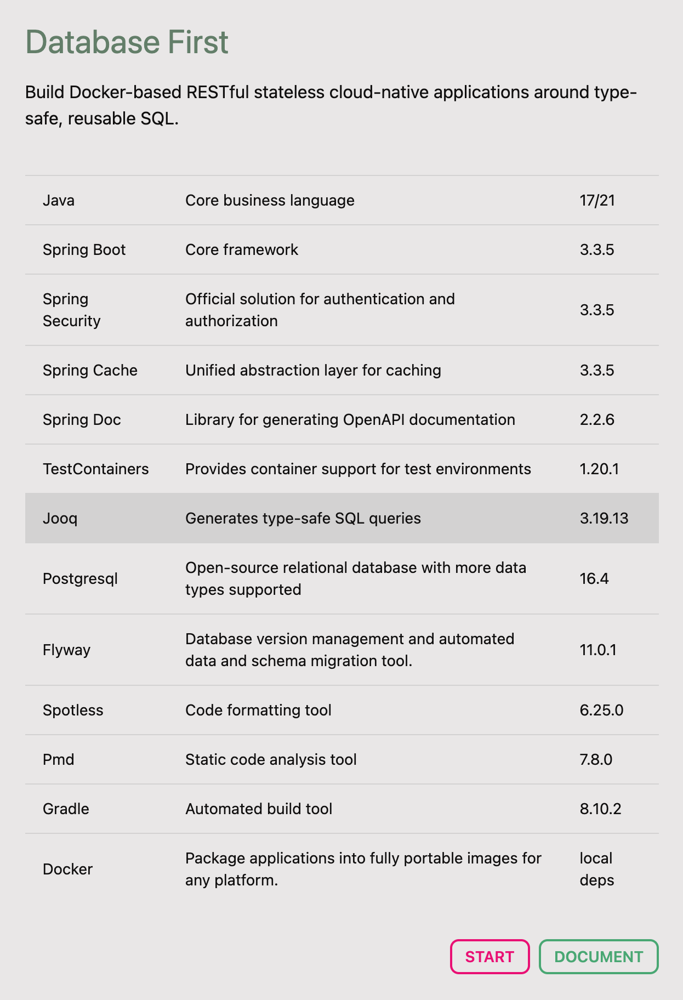
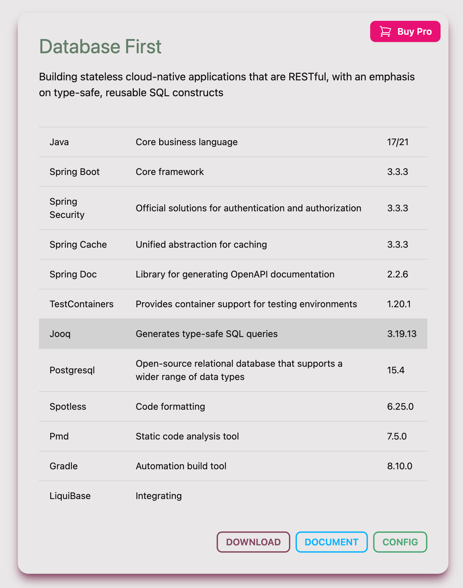

# Make Java Great Again

[](https://choosealicense.com/licenses/mit/)


🏆🎖️🥇🥈🥉🏅

- [English](README_EN.md)
- [中文](README_CN.md)

[MJGA](https://www.mjga.cc) is a modern Java Web scaffolding designed with cloud-native concepts in mind. It offers the
following features:

- Containerized applications
- Modular components
- Highly regarded unit tests

## Technology Stack 🥝



### Containerization and Cloud-Native 🍋

1. Manage the entire lifecycle and configuration of the application via `docker-compose.yml`.
2. Customize all configurations through the `.env` file.
3. Deliver the entire application and its ecosystem components via `docker-compose.yml`.

### Out-of-the-Box 🍌

1. Integrates common basic business functions such as authentication, permission management, and cache abstraction.
2. Code Check&Format, CI/CD Plugin, Docker Integration are all ready to use out-of-the-box.
3. Comprehensive, design-driven, and environment-isolated unit tests.

### Modernization 🍒

1. Modern: Technology choices follow the trends of the open-source community.
2. Configurable: Supports component selection on the web.
3. Best Practices: Every variable, function, module, and component is designed with best practices in mind.
4. Focus on Boundaries: Stays within its functional boundaries, not aiming to be a "Not All In One" solution.

## Component Selection 🍇

More components are under development...



## Quick Start 🍉

**Confirm Environment Variables and Execution Permissions**

```shell
# confirm .env and make sure process can use it
vim ${projectRoot}/.env
# confirm gradlew executable (unix-like OS)
chmod 755 ${projectRoot}/gradlew
```

**[Install Docker and Start Containers](https://docs.docker.com/engine/install/)**

```shell
cd ${projectRoot}
docker compose up -d database
docker compose build web
docker compose up -d web
```

**(Optional) Start Locally**

```shell
# confirm .env and gradle.properties make sure process can use it
vim ${projectRoot}/.env
vim ${projectRoot}/gradle.properties
docker compose up -d database
./gradlew jooqCodegen
${projectRoot}/gradlew bootRun
```

## Common Tools 🥜

**Compile the Project and Generate Table Mapping Objects and Data Access Layer Based on Database Schema**

```shell
# confirm .env and make sure process can use it
vim ${projectRoot}/.env
# generate schema mapping codes
./gradlew jooqCodegen
# output ->
# projectRootDir/build/generated-sources
# └── org.jooq.generated
#    └── tables # table mapping
#       ├── daos # Data Access Layer
#       ├── pojos # mapping dto
#       └── records # jooq query record

```

**Global Code Formatting**

```shell
./gradlew spotlessApply
```

**Global Code Inspection**

```shell
# confirm .env and make sure process can use it
vim ${projectRoot}/.env
./gradlew pmdMain
```

**Unit Testing**

```shell
# confirm .env and make sure process can use it
vim ${projectRoot}/.env
# will automatically generate jacocoTestReport
./gradlew test
```

[More documentation...](https://www.mjga.cc/doc/db-first)

## Test Report 🍓


## Miscellaneous 🍟

1. This repository is primarily for code display and issue collection. The code may lag behind the version available for
   download from the product's official website.
2. Please submit any feedback, discussions, or bugs to the issue tracker, and I will handle them seriously.
3. I also welcome any ideas from other communities and will actively participate in the replies.
4. More new video tutorials are being recorded, please stay tuned.
5. Promote Mjga to your colleagues and friends, and let Java be great again.

## User Community

[](https://dev.to/ccmjga)
[](https://www.mjga.cc)
[](https://x.com/Mjga212318)
[](https://discord.com/invite/3XhyjEPn)
