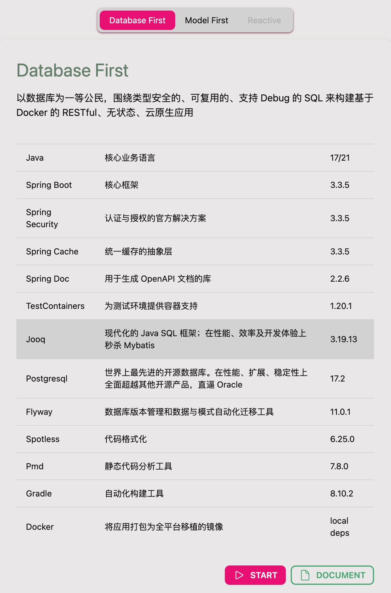
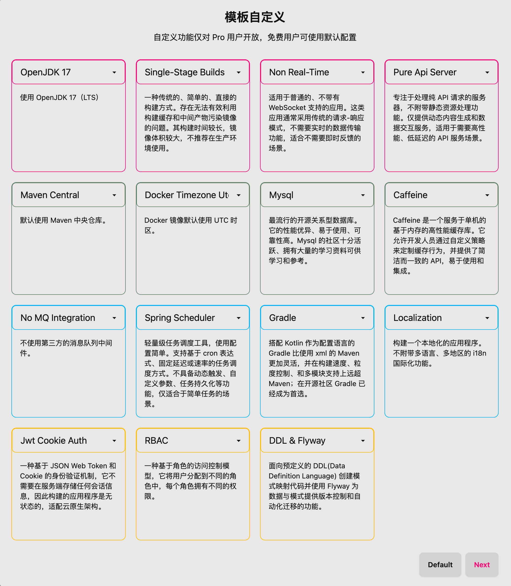

# 🔥 Make Java Great Again！

[](https://choosealicense.com/licenses/mit/)


- [English](README_EN.md)
- [中文](README_CN.md)

## 为何 Mjga 与众不同？

[Mjga](https://www.mjga.cc) 是一款全新设计的，基于云原生理念的打造的现代 Java Web 脚手架，它具备以下特点：

- 容器化的应用
- 可装卸的组件
- 有口皆碑的单元测试
- 自定义元信息

### 🥝 选择模板



### 🍅 组件选配



### 🍹 自定义元信息


#### 容器化与云原生

1. 通过 `docker-compose.yml` 管理应用程序的整个生命周期与配置。
2. 通过 `.env` 文件自定义所有配置。
3. 通过 `docker-compose.yml` 交付整个应用程序和配套的生态组件。

#### 开箱即用

1. 集成了常用的基础业务功能，如身份验证、权限管理和缓存抽象。
2. Code Check&Format、CI/CD Plugin 、Docker Integration 全部开箱即用。
3. 完善的、从设计出发的、隔离了运行环境的单元测试。

#### 现代化

1. 现代化：技术选型紧跟开源社区风向。
2. 可配置化：支持在网页上选配组件。
3. 最佳实践：每个变量和函数、每个模块和组件都考虑最佳实践。
4. 专注边界：将守好自己的功能边界，不做 All In One。


### 快速开始

**确认环境变量与执行权限**

```shell
# confirm .env and make sure process can use it
vim ${projectRoot}/.env
# confirm gradlew executable (unix-like OS)
chmod 755 ${projectRoot}/gradlew
```
**[安装 Docker 并启动容器](https://docs.docker.com/engine/install/)**

```shell
cd ${projectRoot}
docker compose up -d database
docker compose build web
docker compose up -d web
````

**(可选)在本机启动**
```shell
# confirm .env and gradle.properties make sure process can use it
./gradlew jooqCodegen
vim ${projectRoot}/.env
docker compose up -d database
${projectRoot}/gradlew bootRun
```

### 常用工具

**编译项目，并根据数据库 Schema 生成表的映射对象与 Data Access Layer**
```shell
# generate schema mapping codes
./gradlew jooqCodegen
# output ->
# projectRootDir/build/generated-sources
# └── org.jooq.generated
#    └── tables # table mapping
#       ├── daos # Data Access Layer
#       ├── pojos # mapping dto
#       └── records # jooq query record

```

**全局代码格式化**
```shell
./gradlew spotlessApply
```
**全局代码检查**
```shell
./gradlew pmdMain
```

**单元测试**
```shell
# will automatically generate jacocoTestReport
./gradlew test
```

[更多文档请点击...](https://www.mjga.cc/doc/db-first)

## 🍓 测试报告


## 🍟 其他
1. 本仓库主要为代码展示和问题收集使用。代码可能会落后从产品官网下载的版本。
2. 关于产品的意见、讨论、bug 请提交到 issue 中，我会认真处理。
3. 也欢迎其他社区提出你的任何想法，我会积极参与回复。
4. 更多的全新视频教程正在录制中，请耐心等待。
5. 将 Mjga 推广给你身边的同事和朋友，让 Java 再次伟大。

## 🔮 用户社区
产品主页：[](https://www.mjga.cc)

QQ群：[](https://qm.qq.com/q/8ojXz6ZOkE)

文本教程：[](https://juejin.cn/post/7410333135119253543)

视频教程：[](https://www.bilibili.com/video/BV1Erpje8ERF/)
