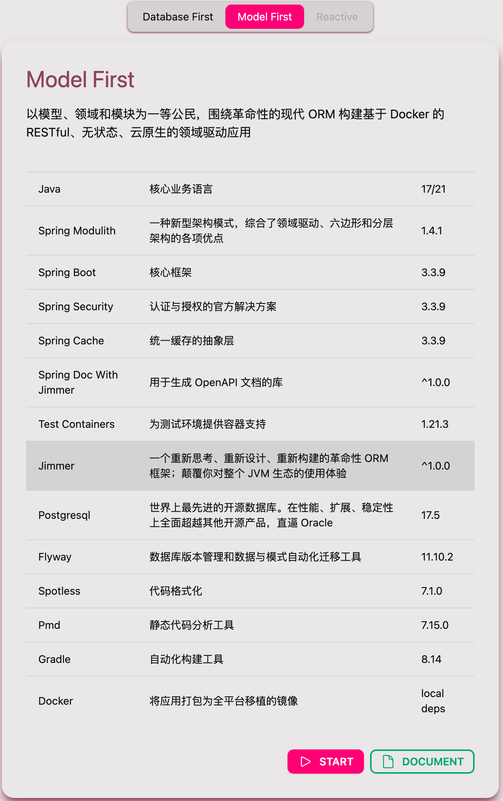

[](https://choosealicense.com/licenses/mit/)


- [中文](README.md)
- [English](README_EN.md)

**请选择您喜爱的工程范式**
- [Database First](https://github.com/ccmjga/mjga-scaffold/)

>以数据库为一等公民，围绕类型安全的、可复用的、支持 Debug 的 SQL 来构建基于 Docker 的 RESTful、无状态、云原生的三层架构应用。

- [Model First](https://github.com/ccmjga/mjga-scaffold/tree/model-first)

>以模型、领域和模块为一等公民，围绕革命性的现代 ORM 构建基于 Docker 的 RESTful、无状态、云原生的领域驱动应用。

# 🔥 Model First


[Mjga](https://www.mjga.cc) 是一款全新设计的，基于云原生理念的打造的现代 Java Web 脚手架，它具备以下特点：

- 容器化的应用
- 可装卸的组件
- 有口皆碑的单元测试
- 自定义元信息

### 🥝 选择模板

### 🍇 以模型和领域为中心的架构设计


### 🍉 使用 Typescript 定义的接口文件


### 🍅 选配领域专属组件


### 🍹 自定义元信息


### 快速开始

```shell
# confirm .env and make sure process can use it
vim ${projectRoot}/.env
# confirm gradlew executable (unix-like OS)
chmod 755 ${projectRoot}/gradlew
```
**[安装 Docker 并启动容器](https://docs.docker.com/engine/install/)**

```shell
cd ${projectRoot}
docker compose up -d database
docker compose build web
docker compose up -d web
````

**(可选)在本机启动**
```shell
# confirm .env and make sure process can use it
docker compose up -d database
${projectRoot}/gradlew bootRun
```

### 常用工具

**编译项目，生成 Model 衍生物与自定义 Dto**
```shell
# generate schema mapping codes
./gradlew build
# output ->
# projectRootDir/build/generated/sources/annotationProcessor/java/main
# └── your.package
#    ├── model -> model artifact
#    └── dto -> dto artifact

```

**全局代码格式化**
```shell
./gradlew spotlessApply
```
**全局代码检查**
```shell
./gradlew pmdMain
```

**单元测试**
```shell
# will automatically generate jacocoTestReport
./gradlew test
```

[更多文档请点击...](https://www.mjga.cc/doc/modelfirst)

## 🍓 测试报告


## 🍟 其他
1. 本仓库主要为代码展示和问题收集使用。代码可能会落后从产品官网下载的版本。
2. 关于产品的意见、讨论、bug 请提交到 issue 中，我会认真处理。
3. 也欢迎其他社区提出你的任何想法，我会积极参与回复。
4. 更多的全新视频教程正在录制中，请耐心等待。

## 🔮 用户社区
产品主页：[](https://www.mjga.cc)

QQ群：[](https://qm.qq.com/q/8ojXz6ZOkE)

文本教程：[](https://juejin.cn/post/7410333135119253543)

视频教程：[](https://www.bilibili.com/video/BV1Erpje8ERF/)
