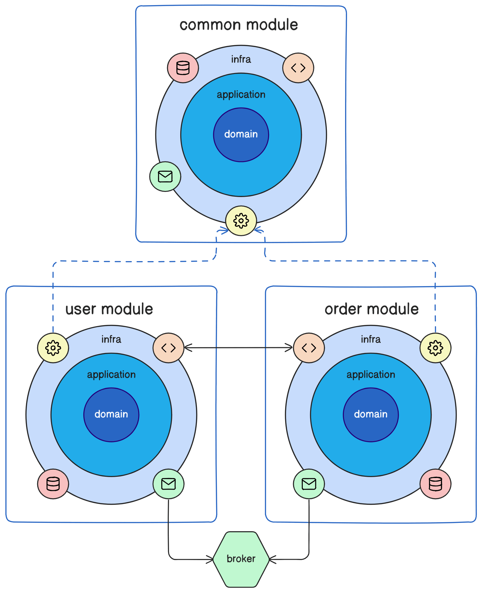
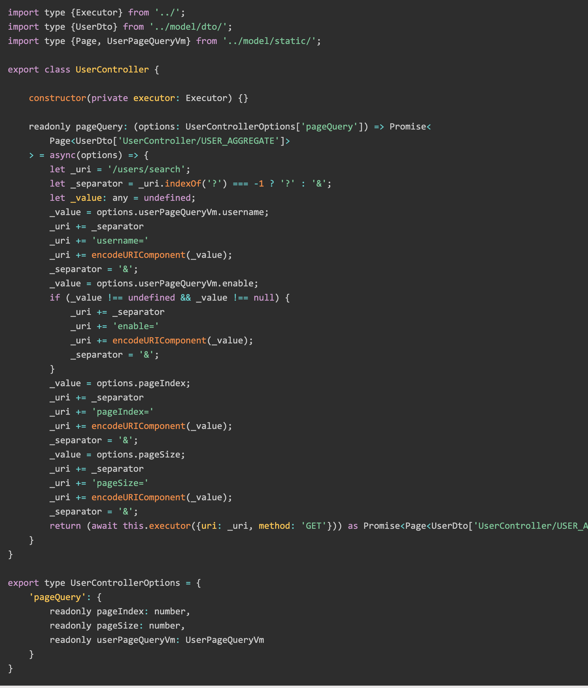
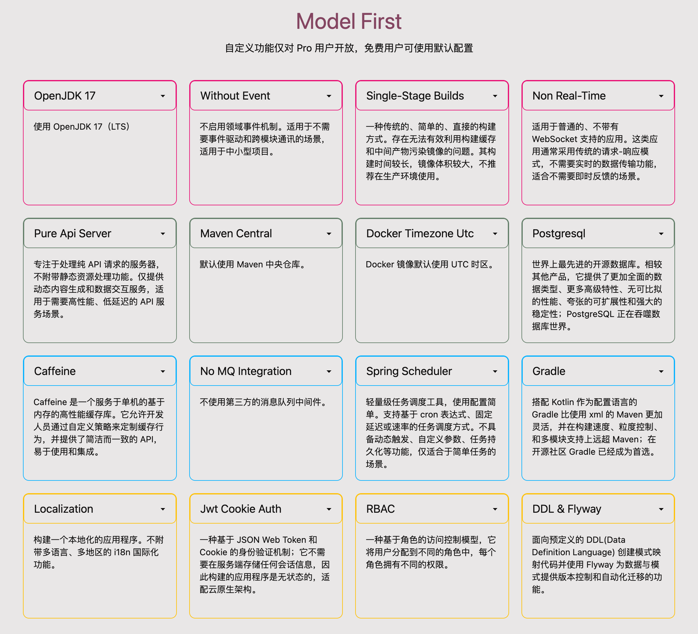
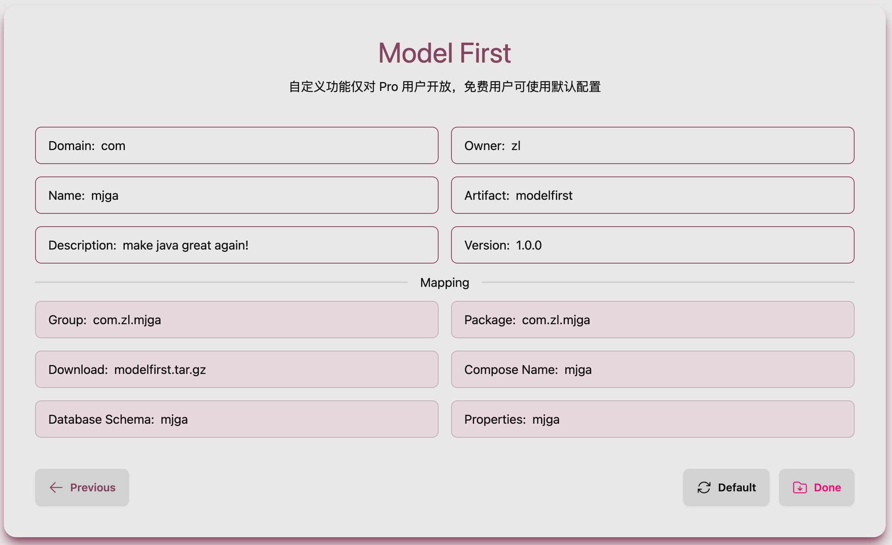

# Model First

- [中文](README.md)
- [English](README_EN.md)

Build RESTful, stateless, cloud-native, Docker-based, domain-driven applications with models, domains, and modules as first-class citizens around the revolutionary modern ORM.

### 🥇 Model and domain-centered architecture design


### 😉 Interface files defined using Typescript


### 🍅 Optional field-specific components



### 🍹 Customizing meta information




### Quick Start

```shell
# confirm .env and make sure process can use it
vim ${projectRoot}/.env
# confirm gradlew executable (unix-like OS)
chmod 755 ${projectRoot}/gradlew
```
**[Install Docker and start the container](https://docs.docker.com/engine/install/)**

```shell
cd ${projectRoot}
docker compose up -d database
docker compose build web
docker compose up -d web
````

**(Optional) Starting locally**
```shell
# confirm .env and make sure process can use it
docker compose up -d database
${projectRoot}/gradlew bootRun
```

### Common Tools

**Compile the project to generate Model derivatives and custom Dto's.**
```shell
# generate schema mapping codes
./gradlew build
# output ->
# projectRootDir/build/generated/sources/annotationProcessor/java/main
# └── your.package 
#    ├── model -> model artifact
#    └── dto -> dto artifact

```

**Global code formatting**
```shell
./gradlew spotlessApply
```
**Global code checking**
```shell
./gradlew pmdMain
```

**Unit test**
```shell
# will automatically generate jacocoTestReport
./gradlew test
```

[For more documents, please click...](https://www.mjga.cc/doc/modelfirst)

## 🍓 Test Report


## 🍟 Miscellaneous

1. This repository is primarily for code display and issue collection. The code may lag behind the version available for
   download from the product's official website.
2. Please submit any feedback, discussions, or bugs to the issue tracker, and I will handle them seriously.
3. I also welcome any ideas from other communities and will actively participate in the replies.
4. More new video tutorials are being recorded, please stay tuned.
5. Promote Mjga to your colleagues and friends, and let Java be great again.

## 🔮 User Community

[](https://dev.to/ccmjga)
[](https://www.mjga.cc)
[](https://x.com/Mjga212318)
[](https://discord.com/invite/3XhyjEPn)
